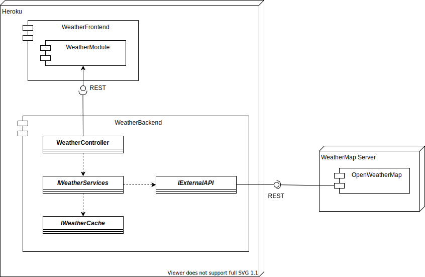

# Escuela Colombiana de Ingeniería Julio Garavito - Arquitecturas de Software ARSW - Parcial Segundo Tercio

## Enlace a la aplicación en Heroku

[](https://toro-arsw-t2.herokuapp.com/)

## Enlace al Repositorio del Parcial

https://github.com/Skullzo/ARSW-Parcial2

## Diseño

Para realizar el parcial del segundo tercio, primero se implementó una arquitectura Cliente-Servidor, donde un servicio REST consume un API, en la cual se utiliza el principio de inyección de dependencias, ya que con esto se garantiza un bajo acoplamiento, y un Front-End que hace que el cliente tenga una interfaz de usuario al momento de consumir los recursos de esta API.

### Diagrama de Clases


### Diagrama Componente y Conector (C&C)


## Extensión

Dado que esta arquitectura fue desarrollada con el principio de inyección de dependencias, resulta muy sencillo hacer uso de las extensiones, ya que si se desea consumir recursos de otras API's solo se deben realizar las respectivas extensiones y luego incluírlas en el sistema.

## Prerrequisitos

Para la realización y ejecución tanto del programa como de las pruebas de este, se requieren ser instalados los siguientes programas:
* [Maven](https://maven.apache.org/). Herramienta que se encarga de estandarizar la estructura física de los proyectos de software, maneja dependencias (librerías) automáticamente desde repositorios y administra el flujo de vida de construcción de un software.
* [GIT](https://git-scm.com/). Sistema de control de versiones que almacena cambios sobre un archivo o un conjunto de archivos, permite recuperar versiones previas de esos archivos y permite otras cosas como el manejo de ramas (branches).
* [Heroku](https://www.heroku.com/). Plataforma en la nube como servicio (PaaS en sus siglas en inglés) basada en contenedores. Los desarrolladores usan Heroku para implementar, administrar y escalar aplicaciones modernas.

Para asegurar que el usuario cumple con todos los prerrequisitos para poder ejecutar el programa, es necesario disponer de un Shell o Símbolo del Sistema para ejecutar los siguientes comandos para comprobar que todos los programas están instalados correctamente, para así compilar y ejecutar tanto las pruebas como el programa correctamente.

```
mvn -version
git --version
java -version
```

## Instalación
Para descargar el proyecto de GitHub, primero debemos clonar este repositorio, ejecutando la siguiente línea de comando en GIT.

```
git clone https://github.com/Skullzo/ARSW-Parcial2.git
```

## Ejecución
Para compilar el proyecto utilizando la herramienta Maven, nos dirigimos al directorio donde se encuentra alojado el proyecto, y dentro de este ejecutamos en un Shell o Símbolo del Sistema el siguiente comando:

```
mvn package
```

## Pruebas
Para realizar las pruebas correspondientes del proyecto utilizando la herramienta Maven, nos dirigimos al directorio donde se encuentra alojado el proyecto, y dentro de este ejecutamos en un Shell o Símbolo del Sistema el siguiente comando:

```
mvn test
```

Luego de haber ejecutado el comando ```mvn test``` en un Shell o Símbolo del Sistema, debe aparecer la siguiente imagen, demostrando que las pruebas han sido realizadas exitosamente.


Al desplegar la aplicación en Heroku, se tiene la siguiente interfaz de usuario, en la cual este puede ingresar el nombre de la respectiva ciudad que se desean saber los respectivos datos como lo son temperatura actual, temperatura mínima, temperatura máxima, humedad relativa, presión atmosférica y ubicación en el mapa de la misma.


Luego de escribir en el campo provisto la ciudad (Bogotá) para probar el correcto funcionamiento de la aplicación, se muestran los datos como lo son temperatura actual, temperatura mínima, temperatura máxima, humedad relativa, presión atmosférica y ubicación en el mapa de la misma.


Para probar que el caché está funcionando correctamente, se ingresa otra ciudad (Londres). Luego de ingresar la ciudad y presionar clic sobre el botón **Buscar**, se muestran los datos como lo son temperatura actual, temperatura mínima, temperatura máxima, humedad relativa, presión atmosférica y ubicación en el mapa de Londres, y también se muestra la ubicación de Bogotá en el mapa, la cual fue la última ciudad consultada antes de realizar la respectiva búsqueda de Londres.


## Construido con
* [Maven](https://maven.apache.org/). Herramienta que se encarga de estandarizar la estructura física de los proyectos de software, maneja dependencias (librerías) automáticamente desde repositorios y administra el flujo de vida de construcción de un software.
* [GIT](https://git-scm.com/). Sistema de control de versiones que almacena cambios sobre un archivo o un conjunto de archivos, permite recuperar versiones previas de esos archivos y permite otras cosas como el manejo de ramas (branches).
* [JUnit](https://junit.org/junit5/). Framework de Java que permite la realización de la ejecución de clases de manera controlada, para poder comprobar que los métodos realizan su cometido de forma correcta.
* [NetBeans](https://netbeans.apache.org/). Entorno de desarrollo integrado libre, orientado principalmente al desarrollo de aplicaciones Java. La plataforma NetBeans permite el desarrollo de aplicaciones estructuradas mediante un conjunto de componentes denominados “módulos”. Cada uno de estos módulos sería un archivo Java conteniendo un conjunto de clases que interactarán con las APIs de NetBeans. El objetivo de esta arquitectura es favorecer el desarrollo de funcionalidades de forma independiente y la reutilización de componentes.
* [Java](https://www.oracle.com/java/). Lenguaje de programación de propósito general, es decir, que sirve para muchas cosas, para web, servidores, aplicaciones móviles, entre otros. Java también es un lenguaje orientado a objetos, y con un fuerte tipado de variables.
* [Heroku](https://www.heroku.com/). Plataforma en la nube como servicio (PaaS en sus siglas en inglés) basada en contenedores. Los desarrolladores usan Heroku para implementar, administrar y escalar aplicaciones modernas.

## Preparación para el Parcial

Con el objetivo de preparar el examen final del segundo tercio, por favor siga las siguientes instrucciones.

1. Explore el API de OpenWeather en el siguiente [enlace](https://openweathermap.org/ ).
2. Use la colección de Postman adjunta para validar el funcionamiento del endpoint por fuera de la página de OpenWeather.
3. Si no ha terminado por completo el último laboratorio, hagalo, si es necesario desde el inicio y completo. En ese laboratorio esta basado el parcial.
4. Revise la documentación de Google Maps para agregar marcadores a un mapa o revise este [Codepen](https://codepen.io/SitePoint/pen/YWKLzv?editors=0110)

## Descripción del Problema a Solucionar

Parcial del segundo tercio

Su compañía lo ha seleccionado para construir una aplicación para consultar el estado del clima en lugares específicos de la tierra.  

La aplicación recibirá en un campo el nombre de una ciudad, por ejemplo `London` para Londres y deberá mostrar la información del clima para esa ciudad. Para esto utilice el API gratuito de [openweathermap](https://openweathermap.org/ ) (Puede crear una cuenta para obtener la llave para realizar consultas). Se le pide que su implementación sea eficiente en cuanto a recursos así que debe implementar un caché que permita evitar hacer consultas repetidas al API externo. Una vez tenga la funcionalidad básica, extienda su implementación para incluir una funcionalidad para mostrar mapas de la ciudad con diferentes capas del clima (revise la funcionalidad del API de mapas de clima y el ejemplo anexo.). La implementación del mapa puede ir directamente a los servicios externos sin pasar por el servidor intermediario.
Sugerencia realice la implementación de manera incremental. Haga commits regulares.

Ejemplo de la interfaz gráfica


La arquitectura debe tener las siguientes características.

1. El cliente Web debe ser un cliente asíncrono que use servicios REST desplegados en Heroku y use Json como formato para los mensajes.
2. La aplicación debe estar desplegada en Heroku.
3. El servidor de Heroku servirá como un gateway para encapsular llamadas a otros servicios Web externos.
4. La aplicación debe ser multiusuario (Sin registro y sin seguridad )
5. Todos los protocolos de comunicación serán sobre HTTP.
6. Los formatos de los mensajes de intercambio serán siempre JSON.
7. La interfaz gráfica del cliente debe ser los más limpia y agradable posible y debe utilizar Bootstrap. Para invocar métodos REST desde el cliente usted puede utilizar la tecnología que desee.
8. Debe construir un cliente Java que permita probar las funciones tanto del servidor fachada como del cliente externo. El cliente utiliza simples conexiones http para conectarse a los servicios. Este cliente debe hacer pruebas de concurrencia a sus servidor Spring.
9 .La fachada de servicios tendrá un caché que permitirá que llamados que ya se han realizado a las implementaciones concretas con parámetros específicos no se realicen nuevamente. Puede almacenar el llamado como un String con su respectiva respuesta, y comparar el string respectivo. Recuerde que el caché es una simple estructura de datos.
10. Si el dato del cache tiene más de 5 min se debe solicitar nuevamente al servidor externo.
11. Se debe poder extender fácilmente, por ejemplo, es fácil agregar nuevas funcionalidades, o es fácil cambiar el proveedor de una funcionalidad.
12. Debe utilizar maven para gestionar el ciclo de vida, git y github para almacenar al código fuente y heroku como plataforma de producción.

AJUSTE LOS DIAGRAMAS DE ARQUITECTURA QUE SEAN NECESARIOS PARA REFLEJAR LAS DESICIONES DE ARQUITECTURA QUE TOMO SOBRE EL DESARROLLO DEL PARCIAL.



## Entrega

1. La aplicación funcionando en Heroku con el nombre (APELLIDO-ARSW-T2) y el código fuente almacenado en un proyecto GitHub con el nombre (APELLIDO-ARSW-T2).
2. Los fuentes deben estar documentados y bien estructurados para generar el Javadoc.
3. El Readme.md debe describir el diseño, la forma de ejecutar el progrema localmente, explicar cómo se puede extender y cómo podría, por ejemplo, hacer que una función específica la implementara un proveedor de servicios diferente.
4. Indique la urls de Github, Heroku
5. Suba el zip del proyecto al aula con el nombre (APELLIDO-ARSW-T2).
6. Guarde una copia de su proyecto.

## Criterios de evaluación:

1. Cliente escrito en JS asíncrono invocando servicios REST (10%)
2. Servidor fachada exponiendo servicios REST (10%)
3. Conexión a servicios externos (10%)
4. Cliente Java para Tests concurrentes  para el servicio en Heroku y para el del proveedor externo(10%)
5. Cache tolerante a la concurrencia y una sola instancia para la aplicación (10%)
6. Implementa la funcionalidad de los mapas de manera asíncrona (15%)
7. Diseño y descripción del diseño son de alta calidad (30%)
    * Extensible
    * Usa patrones
    * Modular
    * Organizado
    * Javadoc publicado
    * Identifica la función de componentes individuales demuestra conocimiento del funcionamiento general de la arquitectura.
    
## Ayuda

* Inicie con la aplicación web basada en spring que le propone Heroku en su guía inicial para java. (https://devcenter.heroku.com/articles/getting-started-with-java)
* Para invocar un servicios get desde java puede hacerlo de manera fácil como muestra el siguiente código, revise la [clase de pruebas adjunto al examen](openWeatherAPITest/src/test/java/openWeatherAPITest/UnirestTest.java) para más información:

```java
@Test
	public void shouldReturnAllCases() throws UnirestException {
		HttpResponse<JsonNode> response = Unirest
				.get("https://covid-19-coronavirus-statistics.p.rapidapi.com/v1/stats")
				.header("x-rapidapi-host", "covid-19-coronavirus-statistics.p.rapidapi.com")
				.header("x-rapidapi-key", "34f05cff54msh30ba6f36c91c183p166499jsn555917ef62b8")
				.asJson();
		
		assertNotNull(response.getBody());
		assertEquals((int)HttpStatus.SC_OK,response.getStatus());
	}
```

*  Parseo de un JSON

```html
<!DOCTYPE html>
<html>
<body>

<h2>Create Object from JSON String</h2>

<p id="demo"></p>

<script>
var txt = '{"name":"John", "age":30, "city":"New York"}'
var obj = JSON.parse(txt);
document.getElementById("demo").innerHTML = "name: " + obj.name + ", age: " + obj.age;
</script>

</body>
</html>

```

* Código de página con Mapa embebido [(Ver archivo)](index.html)
    
## Autor
[Alejandro Toro Daza](https://github.com/Skullzo)
## Licencia & Derechos de Autor
**©** Alejandro Toro Daza, Estudiante de Ingeniería de Sistemas de la [Escuela Colombiana de Ingeniería Julio Garavito](https://www.escuelaing.edu.co/es/).

Licencia bajo la [GNU General Public License](https://github.com/Skullzo/ARSW-Parcial2/blob/main/LICENSE).
